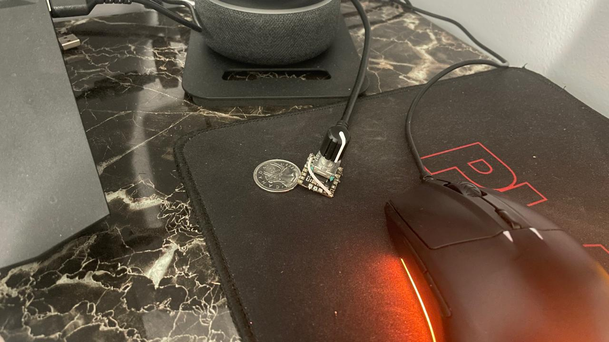
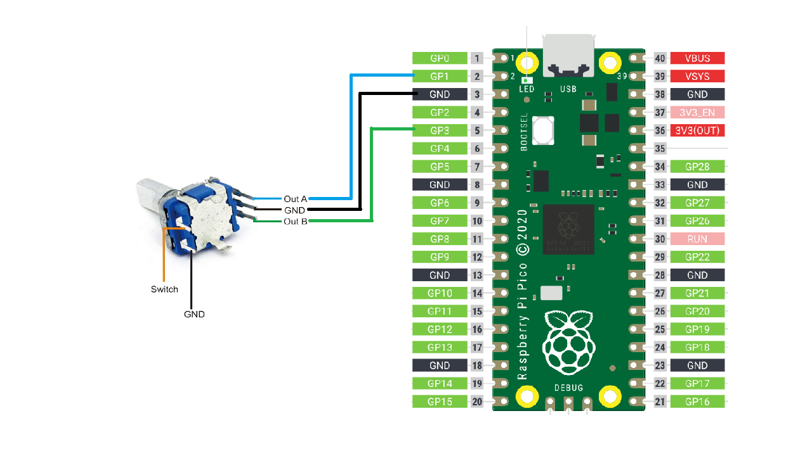

# USB Volume Controller
## [YouTube video](https://youtu.be/UVcvjTeOUdU?si=tyZUI_Gg2oytaHXO)
### Описание проекта на русском языке, смотри ниже [↓](#%D0%BE%D0%BF%D0%B8%D1%81%D0%B0%D0%BD%D0%B8%D0%B5)

## Description

This project is very interesting to me, because it solved one of my daily problems. I have a laptop that I watch YouTube and TV-series on, and sometimes, I need to adjust volume multiple times because of the volume flactuations in the videos. But the problem with manually adjusting the volume is that I need to minimize the screen and adjust the volume from the taskbar. This is very annoying. So, I thought of making a USB volume controller that I can use to adjust the volume without minimizing the screen. This project is the result of that thought.

This project is a **USB volume controller** using a rotary encoder and a Raspberry Pi Pico. The Pico is programmed to act as a **USB HID device** that sends volume commands to the host computer (Same as what keaboard or mouse do). The rotary encoder is used to control the volume. Software used in this project is CircuitPython and HID library from Adafruit.

There is a great article on this project that will help you on setting up the Pico and downloading the Adafruit library. You can find the article [here](https://www.onetransistor.eu/2021/04/media-keys-rpi-pico-circuitpython.html?sc=1721363204924#c4698244853129018643).

## Hardware
- Raspberry Pi Pico
- Rotary encoder
- Breadboard
- Jumper wires
- USB cable

## Software
- [CircuitPython](https://circuitpython.org/board/raspberry_pi_pico/)
- [Adafruit HID library](https://github.com/adafruit/Adafruit_CircuitPython_HID/releases/tag/6.1.1)
- [Thonny IDE](https://thonny.org/)

## Circuit Diagram

The reason behind these pins is that they perfectly allign with the rotary encoder pins and the board that I am using, which is Tiny2040. You can use any other board, but make sure to change the pins in the code accordingly.

---

## Описание

Этот проект очень интересен мне, потому что он решает одну из моих повседневных проблем. У меня есть ноутбук, на котором я смотрю YouTube и сериалы, и иногда мне приходится несколько раз регулировать громкость из-за колебаний громкости в видео. Но проблема в том, что при ручной регулировке громкости мне нужно сворачивать экран и регулировать громкость из панели задач. Это очень раздражает. Поэтому я подумал о создании USB-контроллера громкости, который я мог бы использовать для регулировки громкости без сворачивания экрана. Этот проект - результат этой мысли.

**USB-контроллер громкости** с использованием поворотного энкодера и Raspberry Pi Pico. Pico запрограммирован для работы как **USB HID-устройство**, которое отправляет команды громкости на компьютер (Клавиатура и Мышка используют тот-же принцип). Поворотный энкодер используется для управления громкостью. В этом проекте используется CircuitPython и библиотека HID от Adafruit.

Есть отличная статья по этому проекту, которая поможет вам настроить Pico и загрузить библиотеку Adafruit. Вы можете найти статью на англ [здесь](https://www.onetransistor.eu/2021/04/media-keys-rpi-pico-circuitpython.html?sc=1721363204924#c4698244853129018643).

## Компоненты
- Raspberry Pi Pico
- Поворотный энкодер
- Макетная плата
- Провода
- USB кабель

## Программы
- [CircuitPython](https://circuitpython.org/board/raspberry_pi_pico/)
- [Библиотека Adafruit HID](https://github.com/adafruit/Adafruit_CircuitPython_HID/releases/tag/6.1.1)
- [Среда разработки Thonny](https://thonny.org/)

## Схема

Причина выбора этих выводов заключается в том, что они идеально соответствуют выводам поворотного энкодера и плате, которую я использую, которая называется Tiny2040. Вы можете использовать любую другую плату, но не забудьте изменить выводы в коде соответственно.
